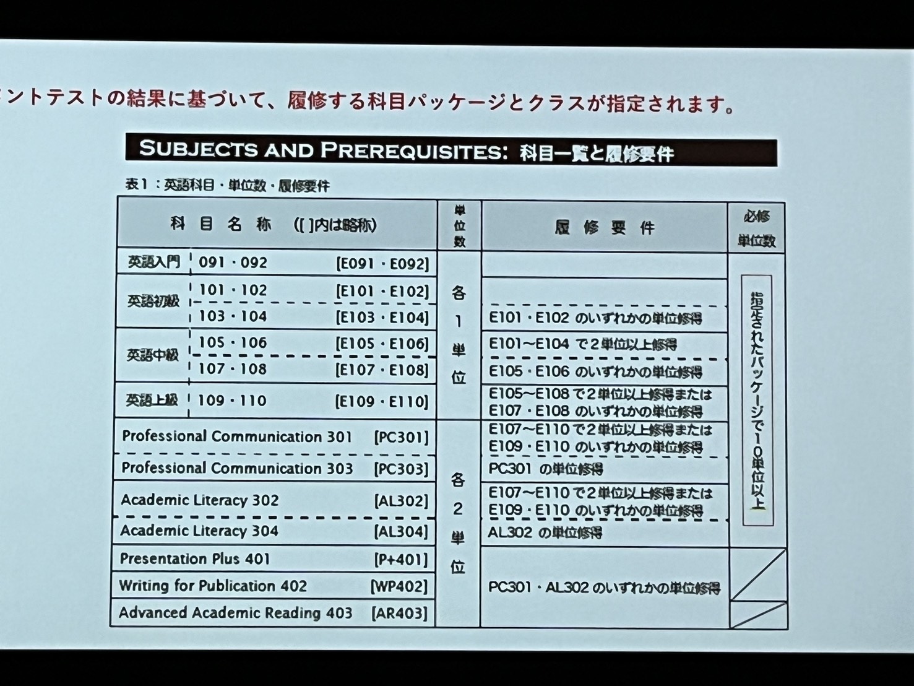
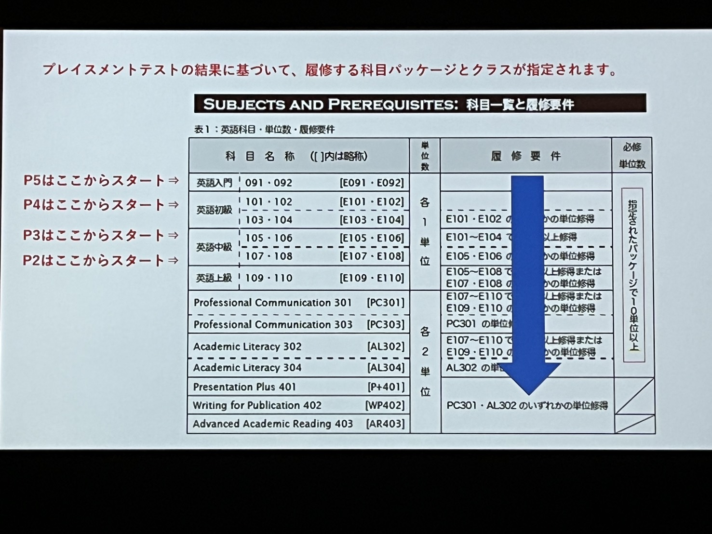

<!-- BREADCRUMB:START -->
[2026](../) > [long](./) > [en-class](en-class.md)
<!-- BREADCRUMB:END -->

1.外国語学習ハンドブック
2.英語科目のクラス分け　履修
3.TOEIC団体受験
4.成績評価
5.授業開始までの注意事項

## 1->moodle+RからPDFをダウンロードして確認

## 2->クラス分け

は、入学前のTOEICスコアをもとに行われる。クラス分けは５つのPackage（クラスより大きい単位）

| パッケージ | 内容 |
|:---:|:---|
| P1 | ISSE course |
| P2 | R1, Q1 |
| P3 | R2, R3, Q2, Q3 |
| P4 | R4, R5, Q4, Q5 |
| P5 | R6, R7, Q6, Q7 |

10種類の科目、１０単位をパッケージで履修
指定されたパッケージの科目を順に２科目　楽器ずつ履修
１回生春～２回生秋・３回生春　まで履修
F評価の場合再履修あり

TOEICは良くも悪くも成績に響く

E101~110の科目は受験義務あり
これらについては外国語学習ハンドブックを確認

## 成績評価
１０回以上の授業出席が必須　問答無用でF評価

ハンドブック確認傾斜あり
中級以上でA＋あり

## 授業開始までの注意事項
クラス分けは自動決定
履修登録不要
大学生協でテキスト購入
第一回の授業までに+R授業のビデオ解説を必ず視聴（今週中）

すべて、詳しくは外国語学習ハンドブックを確認
遅刻欠席は原点

<!-- BREADCRUMB:START -->
[2026](../) > [long](./) > [en-class](en-class.md)
<!-- BREADCRUMB:END -->
