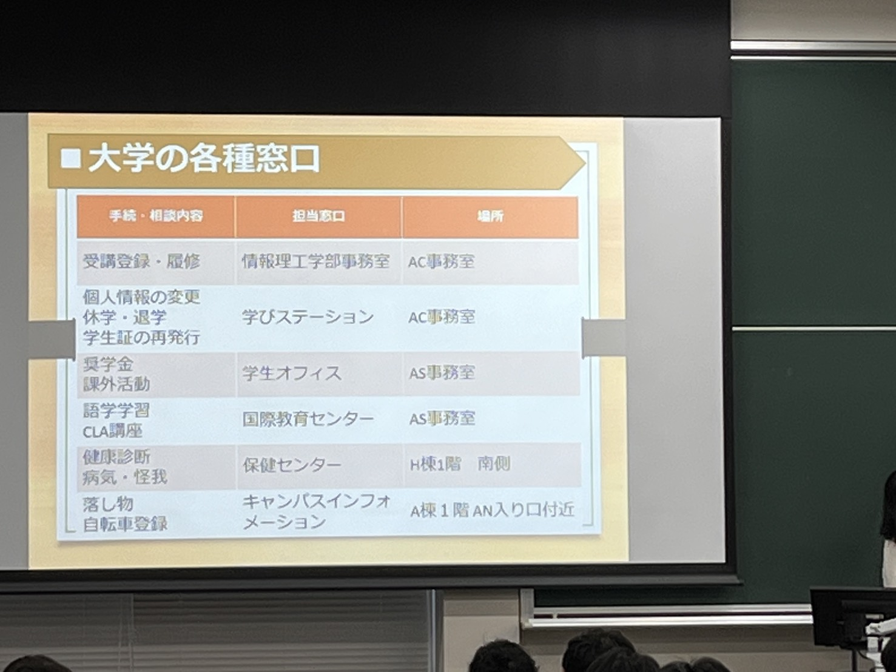

<!-- BREADCRUMB:START -->
[2026](../) > [long](./) > [大学生活と](lifeplan.md)
<!-- BREADCRUMB:END -->

# 大学生活と

1年生
コース選択

２ー３の上がるタイミングで
進級制度
１回生春
２回生秋　新旧制度

バイト週３
サークル週１
英語週１

システムアーキテクト
セキュリティネットワーク
社会システムデザイン
実世界情報
メディア情報
知能情報
ISSE

コースの先にある研究室を見るのが大事

３回生
研究室配属

４回生
週４　院の講義を先取りできる早期履修
単位取り切っておくと安心
バイト週３継続

---

自習場所
モニター
複数人利用あり

図書館

まなびLAぼ
毎日5限にH棟６F

数学学習相談会

- 担当の先生
- コースの先生
- まなびLAぼ
- 事務室
- 学びステーション
- 学生オフィス
- SSP(Student Success Program)
>どうしても出来ん時に相談できる場所 朝起きれんとか

### 学びステーションとは
とりま行くところ　窓口わからんかったらここに行く
課題レポート提出
返却物受け取り
学生証再発行
講義レジュメガイダンス
etc

ACに情報理工学部事務室と学びステーションがある
月～金　8:45~17:00
オリエンテーション機関中は9:00~17:00

---

就職活動
３回生春エントリーシート
インターン
院進学のため冬で停止
修士１年で再度インターン
年々就職活動が早くなっている　早めに行動

社会知能研究室　異文化コラボレーション
クラウド上の多言語サービスを組み合わせて異文化コラボレーションを支援

<!-- BREADCRUMB:START -->
[2026](../) > [long](./) > [大学生活と](lifeplan.md)
<!-- BREADCRUMB:END -->
